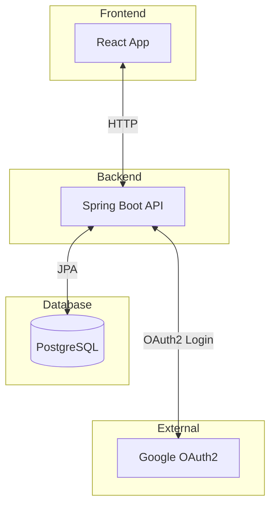
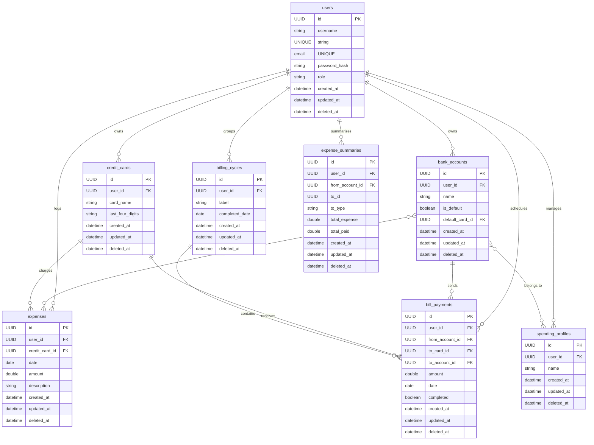
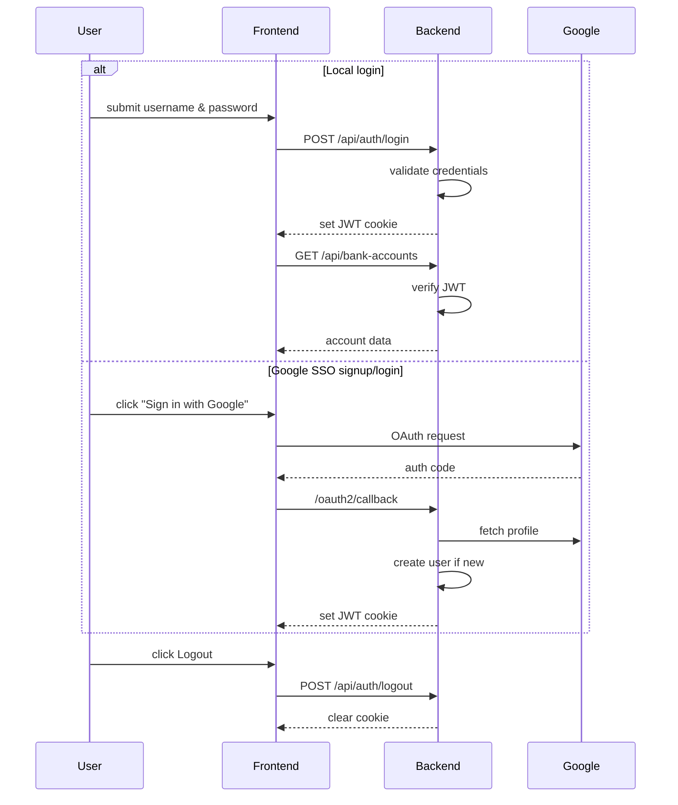
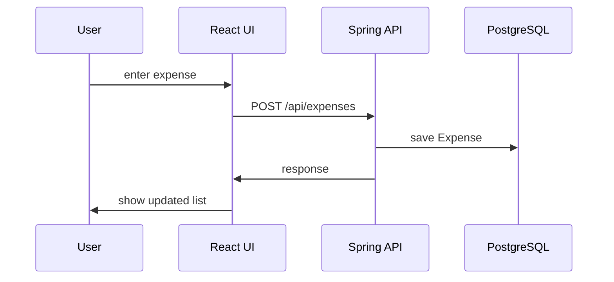

# Credit Card Bill Tracker - Architecture & Handover

## 1. Project Overview
This project manages personal credit card finances. It contains:
- **Backend**: Spring Boot application with REST APIs for bank accounts, credit cards, expenses, bill payments and billing cycles.
- **Frontend**: React SPA built with Vite and TypeScript.
- **Database**: PostgreSQL persisted via JPA and Liquibase migrations.

Primary user role is an authenticated individual tracking expenses and payments across multiple cards and bank accounts.

## 2. High-Level Architecture


## 3. Component Breakdown
### Frontend
- React + Vite SPA with routes defined in `App.tsx`.
- State managed with Zustand (`src/store/auth.ts`).
- API wrapper uses Axios (`src/lib/api.ts`).

### Backend
- Spring Boot 3, Java 21 and JPA. Main entry in `BackendApplication.java`.
- Modules: bankaccount, creditcard, expense, billpayment, billingcycle, expensesummary, spendingprofile, user, auth.
- Controllers expose REST endpoints under `/api/*` paths.
- Security uses JWT with cookies and Google OAuth2 for login.

### Database
- PostgreSQL with entities such as User, BankAccount, CreditCard, Expense, BillPayment, BillingCycle etc.
- Schema managed by Liquibase (`db.changelog-master.xml`).



#### Data Dictionary

##### users
| Column | Type | Notes |
| --- | --- | --- |
| id | UUID | primary key |
| username | string | unique |
| email | string | unique |
| password_hash | string | hashed password |
| role | string | user role |
| created_at | datetime | record creation |
| updated_at | datetime | last update |
| deleted_at | datetime | soft delete timestamp |

##### bank_accounts
| Column | Type | Notes |
| --- | --- | --- |
| id | UUID | primary key |
| user_id | UUID | FK to users |
| name | string | account label |
| is_default | boolean | marks default account |
| default_card_id | UUID | FK to credit_cards |
| created_at | datetime | record creation |
| updated_at | datetime | last update |
| deleted_at | datetime | soft delete timestamp |

##### credit_cards
| Column | Type | Notes |
| --- | --- | --- |
| id | UUID | primary key |
| user_id | UUID | FK to users |
| card_name | string | card label |
| last_four_digits | string | card ending |
| created_at | datetime | record creation |
| updated_at | datetime | last update |
| deleted_at | datetime | soft delete timestamp |

##### expenses
| Column | Type | Notes |
| --- | --- | --- |
| id | UUID | primary key |
| user_id | UUID | FK to users |
| credit_card_id | UUID | FK to credit_cards |
| date | date | transaction date |
| amount | double | amount spent |
| description | string | merchant or notes |
| created_at | datetime | record creation |
| updated_at | datetime | last update |
| deleted_at | datetime | soft delete timestamp |

##### bill_payments
| Column | Type | Notes |
| --- | --- | --- |
| id | UUID | primary key |
| user_id | UUID | FK to users |
| from_account_id | UUID | FK to bank_accounts |
| to_card_id | UUID | FK to credit_cards |
| to_account_id | UUID | FK to bank_accounts |
| amount | double | payment amount |
| date | date | payment date |
| completed | boolean | if payment executed |
| created_at | datetime | record creation |
| updated_at | datetime | last update |
| deleted_at | datetime | soft delete timestamp |

##### billing_cycles
| Column | Type | Notes |
| --- | --- | --- |
| id | UUID | primary key |
| user_id | UUID | FK to users |
| label | string | cycle name |
| completed_date | date | closing date |
| created_at | datetime | record creation |
| updated_at | datetime | last update |
| deleted_at | datetime | soft delete timestamp |

##### expense_summaries
| Column | Type | Notes |
| --- | --- | --- |
| id | UUID | primary key |
| user_id | UUID | FK to users |
| from_account_id | UUID | FK to bank_accounts |
| to_id | UUID | target entity id |
| to_type | string | target type |
| total_expense | double | aggregated spending |
| total_paid | double | aggregated payments |
| created_at | datetime | record creation |
| updated_at | datetime | last update |
| deleted_at | datetime | soft delete timestamp |

##### spending_profiles
| Column | Type | Notes |
| --- | --- | --- |
| id | UUID | primary key |
| user_id | UUID | FK to users |
| name | string | profile label |
| created_at | datetime | record creation |
| updated_at | datetime | last update |
| deleted_at | datetime | soft delete timestamp |

### Authentication & Authorization

- Security configuration registers JWT filter and OAuth2 handlers.

### Third-party Integrations
- **Google OAuth2** for optional login.
- **Liquibase** for database migrations.
- **Springdoc/Swagger** for API documentation.

## 4. Data Flow


## 5. Deployment & Environment Setup
After cloning the repository you can bootstrap a local environment with:

```bash
bash server/scripts/setup-dev.sh
```

This links the Git hook and creates `/server/.env` for Liquibase. Next copy
`server/src/main/resources/application-template.properties` to
`server/src/main/resources/application-local.properties` and fill in your
database URL, credentials and OAuth settings. The backend reads this file when
`spring.profiles.active=local`.

CI is handled by GitHub Actions (`test.yml`) which builds the Maven and npm
projects and validates Liquibase changelogs. Runtime environments include local,
CI (`application-ci.properties`) and production with external config files.

## 6. Monitoring, Logging, & Alerts
- Spring Boot Actuator exposes health endpoint.
- Logging aspect logs all service calls.
- GitHub Actions artifacts provide build outputs.

## 7. Security & Compliance
- JWT stored in HTTP-only cookie; tokens generated and validated via `JwtUtil`.
- Login attempts rate-limited (`LoginAttemptService`).
- Passwords hashed using BCrypt.

## 8. Known Issues & Technical Debt
- Database schema is still empty; changelogs need to be generated as entities evolve.
- No front-end tests; coverage limited.

## 9. Future Enhancements
- Add more integration tests and front-end UI tests.
- Expand Liquibase changelogs and automate migrations.
- Containerize with Docker/Kubernetes for easier deployment.
